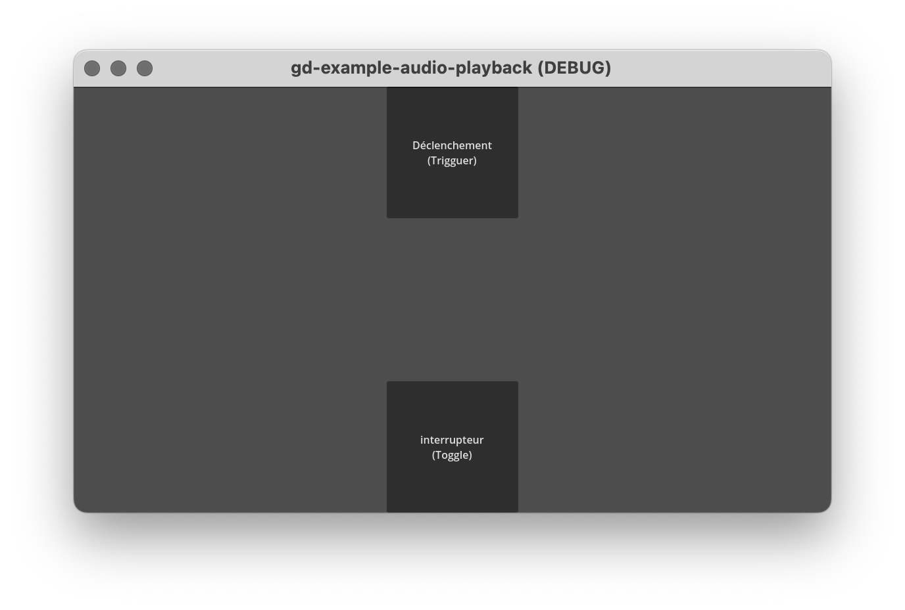
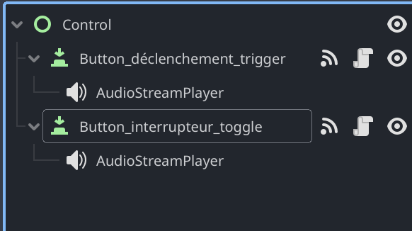
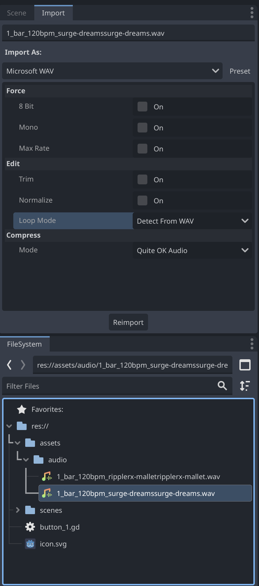
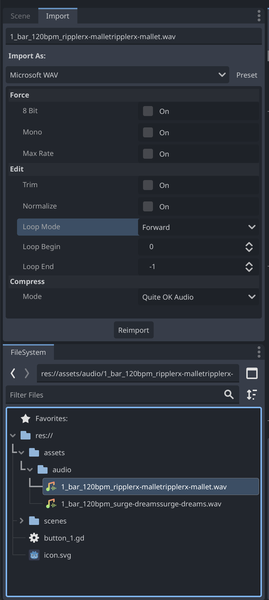
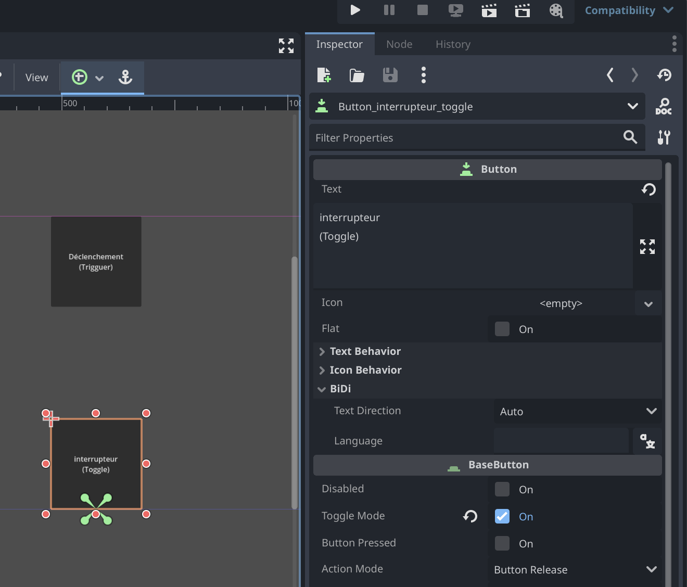
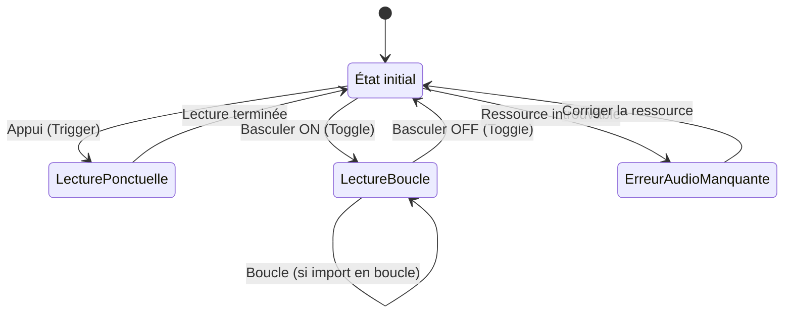

# gd-example-audio-playback



Ce projet Godot démontre deux manières de faire jouer du sons.

Le bouton du haut déclenche un son le temps d'une lecture, le bouton du bas active une boucle qui joue jusqu'à ce ce que l'on l'état de son bouton revienne à 0.





# gd-example-audio-playback


Ce projet Godot montre deux manières de faire jouer des sons.

Le bouton du haut déclenche un son pour la durée d'une lecture ; le bouton du bas active une boucle qui joue tant que le bouton reste activé.


## Paramètres d'importation sonore


Depuis l'explorateur de fichiers (file system), sélectionnez le fichier audio et personnalisez les paramètres d'importation pour déterminer si celui‑ci doit être lu en boucle lorsqu'il est déclenché. Par défaut, il est lu une seule fois (sans boucle).

| Déclenchement | Interrupteur (Boucle) | 
|---|---|
| |  |


## Comportement d'un bouton


### Déclenchement (trigger)

Par défaut, le bouton se comporte comme un déclencheur : aucune personnalisation n'est nécessaire.

Attachez l'appel `play()` du nœud `AudioStreamPlayer` au signal `_on_pressed()` :

```gdscript
func _on_pressed() -> void:
	$AudioStreamPlayer.play()
```

### Interrupteur (toggle)

Pour obtenir un comportement d'interrupteur, activez le mode bascule du bouton (toggle_mode) afin qu'il conserve son état.



Attachez l'appel `play()` / `stop()` du nœud `AudioStreamPlayer` au signal `_on_toggled(toggled_on: bool)` :

```gdscript
func _on_toggled(toggled_on: bool) -> void:
	if toggled_on:
		$AudioStreamPlayer.play()
	else:
		$AudioStreamPlayer.stop()
```

Utilisez le booléen `toggled_on` pour déterminer l'état de lecture du fichier audio.

## Diagramme d'états

Le diagramme ci‑dessous illustre le comportement attendu des boutons : un bouton de type « déclenchement » (trigger) lance une lecture ponctuelle qui revient à l'état « au repos » à la fin, tandis que le bouton de type « interrupteur » (toggle) active/désactive une lecture en boucle.



*Notes* :
- « LecturePonctuelle » correspond à l'appel `play()` sur un `AudioStreamPlayer` pour une lecture unique.
- « LectureBoucle » suppose que l'audio est importé en mode boucle ou que la propriété `loop` est activée.


